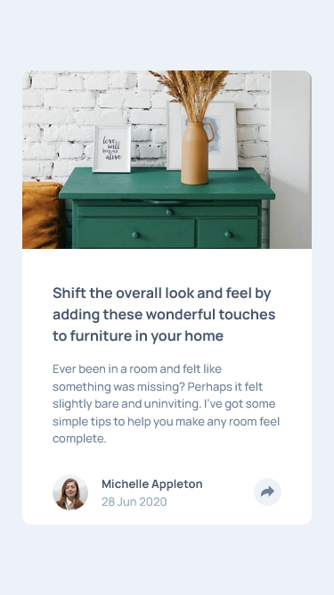
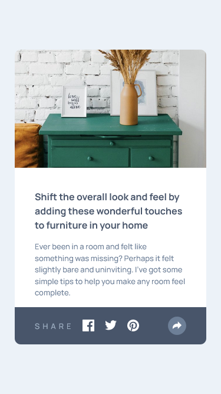
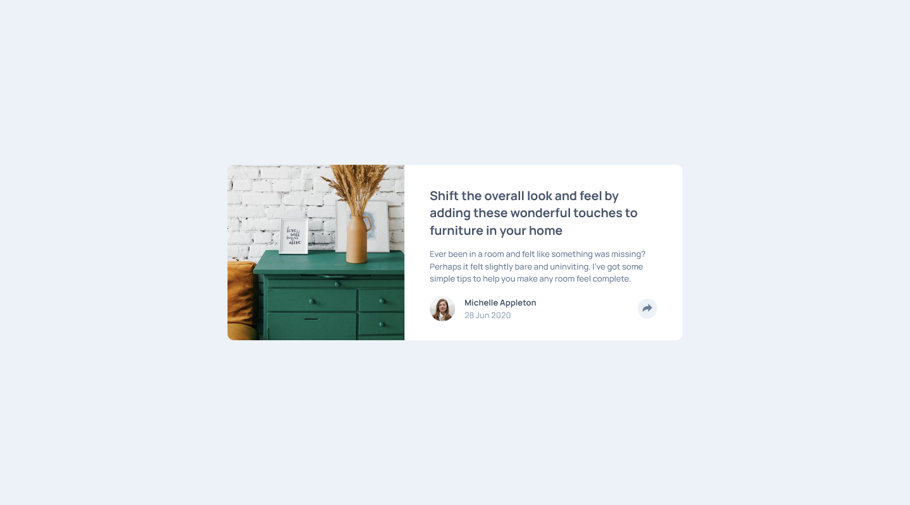
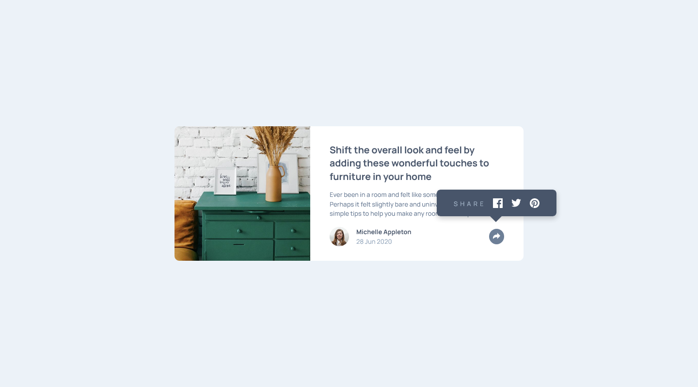

# Frontend Mentor - Article preview component solution

This is a solution to the [Article preview component challenge on Frontend Mentor](https://www.frontendmentor.io/challenges/article-preview-component-dYBN_pYFT). Frontend Mentor challenges help you improve your coding skills by building realistic projects. 

## Table of contents

- [Overview](#overview)
  - [The challenge](#the-challenge)
  - [Screenshot](#screenshot)
  - [Links](#links)
- [My process](#my-process)
  - [Built with](#built-with)
- [Author](#author)

## Overview

### The challenge

Users should be able to:

- View the optimal layout for the component depending on their device's screen size
- See the social media share links when they click the share icon

### Screenshot

#### Result Mobile

#### Result Desktop

### Links

- Solution URL: [Repository Project](https://github.com/Samuel-Amaro/article-preview-component)
- Live Site URL: [Result Live](https://samuel-amaro.github.io/article-preview-component/)

## My process

### Built with

- Semantic HTML5 markup
- CSS custom properties
- Flexbox
- CSS Grid
- Mobile-first workflow
- RWD(Responsive Web Design)
- JavaScript programming language
- Media Querys CSS
- DOM JS
- Normalize CSS - [Normalize](https://necolas.github.io/normalize.css/) - Reset CSS
- Methodology BEM(Block Element Modifier) - [BEM](http://getbem.com/introduction/) - Methodology
- CSS properties animations

## Author

- Website - [Samuel-Amaro](https://www.linkedin.com/in/samuel-amaro/)
- Frontend Mentor - [@Samuel-Amaro](https://www.frontendmentor.io/profile/samuel-amaro)

